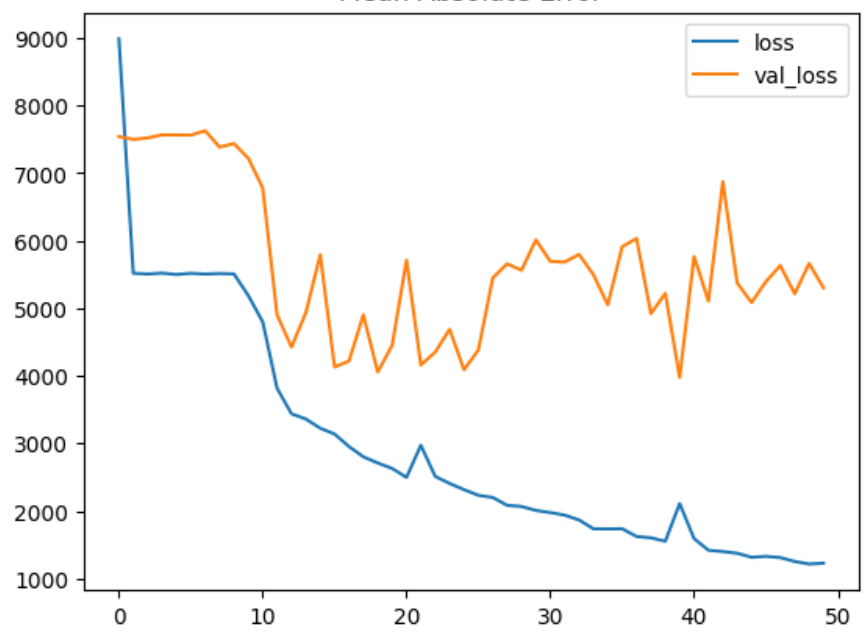
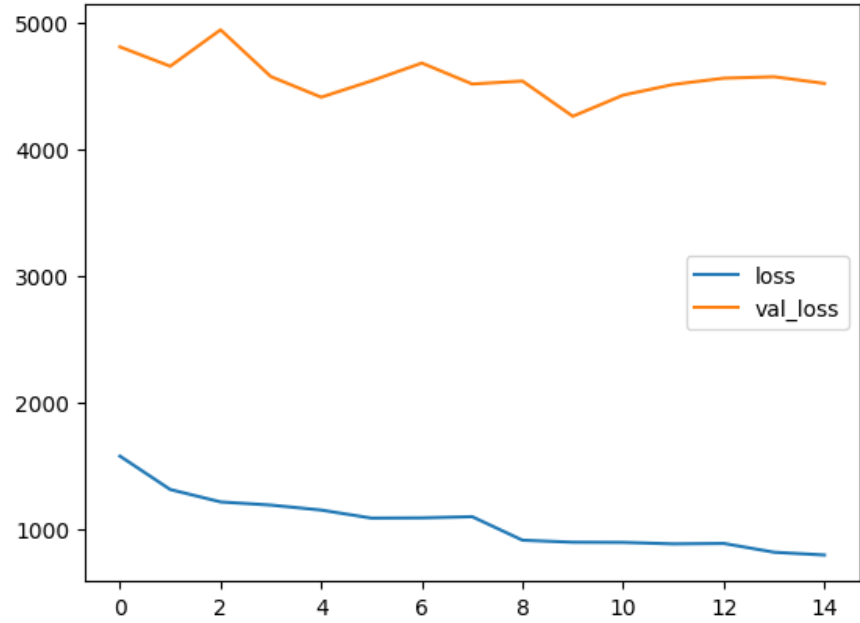

# *Turbofan Jet Engine: Predictive Maintenance Dashboard*

---

## Project Overview
- This project implements a Deep Learning (LSTM) pipeline to predict the Remaining Useful Life (RUL) of aircraft engines using NASA's CMAPSS dataset.
- By analyzing multivariate time-series sensor data, the model identifies degradation patterns to forecast when an engine will fail, enabling "Predictive Maintenance" instead of "Reactive Repair."

---

## Dataset Description

- The model is trained on the *NASA CMAPSS* (Commercial Modular Aero-Propulsion System Simulation) dataset.
- Structure: Multiple multivariate time series representing different engine units.
- Conditions: Variable operating settings (Sea Level to High Altitude).
- Input: 21 sensor measurements (Temperature, Pressure, Fan Speeds) and 3 operational settings with `time_cycles`
  
`Objective`: Predict the number of cycles remaining before engine failure (`RUL`)

---

## Technical Pipeline

1. Data Engineering & Statistics
- *Normalization*: Used MinMaxScaler to scale features between 0 and 1, ensuring stable Gradient Descent and preventing sensor magnitude imbalance.
- *Sequence Generation*: Transformed 2D tabular data into 3D Tensors (Samples, Time-Steps, Features) using a sliding window of 50 cycles to capture temporal dependencies.

---

2 . Deep Learning Architecture
- Model: Stacked LSTM (Long Short-Term Memory) Network.
- Layers: Input(shape=(50, 18))
- LSTM (100 units) + BatchNormalization + Dropout(0.3)
- LSTM (50 units) + Dropout(0.3)
- Dense (1 unit, Linear Activation (`RELU`))
- Optimization: Adam optimizer with Mean Squared Error (MSE) loss function.

---

3. Overfitting Prevention
- EarlyStopping: Monitored `val_loss` to stop training at the point of peak generalization (Epoch 13).
- ReduceLROnPlateau: Dynamically adjusted the learning rate to settle into the global minimum smoothly.

4. Evaluation
- `MSE` : *28.59*
- `R2_score` : *0.44*

5. Model Performance History

- First Trial

- Second Trial

- Third Trial

- Fouth Trial

--- 

